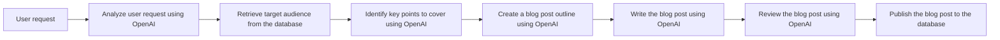
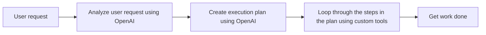

## What is an Agentic AI Agent?

When I think of an AI agent, I think of a system that uses Natural Language Processing (NLP) to understand a user's request and complete a task.

There are two types of AI agents:

- **Rule-based agents**: These agents follow a set of predefined rules to perform tasks.
- **Agentic agents**: These agents can analyze user requests, create execution plans, and use custom tools to get work done.

    **Do you need an agentic agent?**: Depends on your use case. If the flow is
    predictable and you can define the steps in advance, you can use a
    rule-based agent. If the user requests are unpredictable and you need to
    build a more complex agent that can analyze user requests, create execution
    plans, and use custom tools to get work done, you need an agentic agent. In
    most cases you will require a combination of both.

### Rule-based agents

Rule-based agents are a type of agent that follow a set of predefined sequential rules to perform tasks.

These can be powerful and effective, and in most cases will be the best solution as they are more predictable.

For example, you might want an agent to create a blog post based on a user request. You can define the steps in advance, and the agent will follow them in order:

1. Analyze the user request using OpenAI
2. Retrieve the target audience from the database
3. Identify key points to cover using OpenAI
4. Create a blog post outline using OpenAI
5. Write the blog post using OpenAI
6. Review the blog post using OpenAI
7. Publish the blog post to the database

### Agentic agents

Agentic agents are **non-deterministic** agents that can analyze user requests, create execution plans, and use custom tools to get work done.

These are more complex, but can be more flexible and powerful.

You only want to use an agentic AI agent if the flow is not predictable. The agents will recieve a user request, and then need to decide what to do next.

Given the nature of the agentic AI agent, you will need to build the agent to handle the unpredictable nature of the user request.

In our example, we will be building an agentic agent that can analyze a user request, create an execution plan, and loop through the steps in the plan using custom tools to get work done.

**Building an Agentic AI Agent**: In the Building an AI Agent using Laravel series we will be building an agentic agent that can analyze a user request, create an execution plan, and loop through the steps in the plan using custom tools to get work done.

- [Part 1 - Getting Started](/posts/aiagentopart1)
- [Part 2 - Creating a Basic AI Chat Application](/posts/aiagentopart2)
- [Part 3 - Building Tools](/posts/aiagentopart3)
- [Part 4 - Adding State to the Agent](/posts/aiagentopart4)
- [Part 5 - Adding Planning to the Agent](/posts/aiagentopart5)
